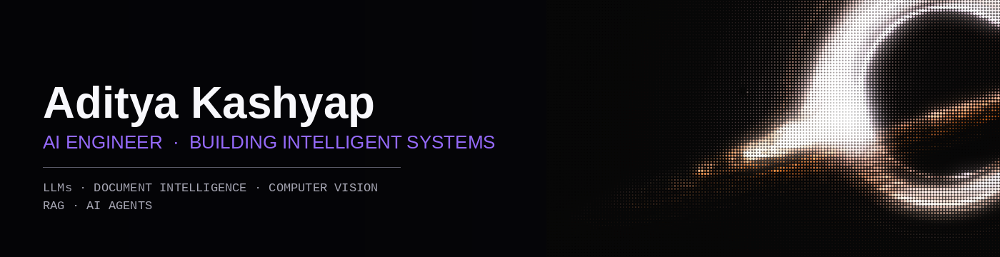

  

 

<table>
<tr>

  

 

<table>
<tr>
<td width="60%" valign="top">

### Hey there! I'm Aditya 👋

**AI Engineer** *(Building Intelligent Systems)*

I'm based in [your city] and focused on building production-ready AI systems — think **LLMs**, **RAG pipelines**, **document intelligence**, and **computer vision** — wired into real backends, not notebooks.

I like turning messy, ambiguous problems into scalable, working software.

</td>
<td width="40%" valign="top">

**Currently**

`↳` Building **Auroraa Vault** — AI-driven document intelligence

`↳` Exploring agentic RAG + local LLM deployments

`↳` Refining my stack: `FastAPI` · `LangChain` · `Next.js`

</td>
</tr>
</table>

 

 

## Pinned

<table>
<tr>
<td width="50%" valign="top">

**Auroraa Vault**
Document intelligence platform — ingest, embed, and query messy documents through a RAG pipeline.

`Python` · `FastAPI` · `LangChain` · ⭐ —

</td>
<td width="50%" valign="top">

**Career Agent**
Autonomous agent that scrapes job boards, tracks applications, and keeps a live status log.

`Python` · `RAG` · `HuggingFace` · ⭐ —

</td>
</tr>
<tr>
<td width="50%" valign="top">

**Movify**
Full-stack app for [short description] with an AI-assisted recommendation layer.

`Next.js` · `Tailwind` · `OpenAI` · ⭐ —

</td>
<td width="50%" valign="top">

**Home Credit**
Computer vision pipeline for [short description of the problem/dataset].

`PyTorch` · `OpenCV` · ⭐ —

</td>
</tr>
</table>

 

## Activity

 

 

## Beyond the Code

Into pixel art, retro game design, and anime — worldbuilding and systems design done seriously. Currently:

 

Aditya Kashyap · AI Engineer

<td width="60%" valign="top">

### Hey there! I'm Aditya 👋

**AI Engineer** *(Building Intelligent Systems)*

I'm based in [your city] and focused on building production-ready AI systems — think **LLMs**, **RAG pipelines**, **document intelligence**, and **computer vision** — wired into real backends, not notebooks.

I like turning messy, ambiguous problems into scalable, working software.

</td>
<td width="40%" valign="top">

**Currently**

`↳` Building **Auroraa Vault** — AI-driven document intelligence

`↳` Exploring agentic RAG + local LLM deployments

`↳` Refining my stack: `FastAPI` · `LangChain` · `Next.js`

</td>
</tr>
</table>

 

 

## Pinned

<table>
<tr>
<td width="50%" valign="top">

**Auroraa Vault**
Document intelligence platform — ingest, embed, and query messy documents through a RAG pipeline.

`Python` · `FastAPI` · `LangChain` · ⭐ —

</td>
<td width="50%" valign="top">

**Career Agent**
Autonomous agent that scrapes job boards, tracks applications, and keeps a live status log.

`Python` · `RAG` · `HuggingFace` · ⭐ —

</td>
</tr>
<tr>
<td width="50%" valign="top">

**Movify**
Full-stack app for [short description] with an AI-assisted recommendation layer.

`Next.js` · `Tailwind` · `OpenAI` · ⭐ —

</td>
<td width="50%" valign="top">

**Home Credit**
Computer vision pipeline for [short description of the problem/dataset].

`PyTorch` · `OpenCV` · ⭐ —

</td>
</tr>
</table>

 

## Activity

 

 

## Beyond the Code

Into pixel art, retro game design, and anime — worldbuilding and systems design done seriously. Currently:

 

Aditya Kashyap · AI Engineer

